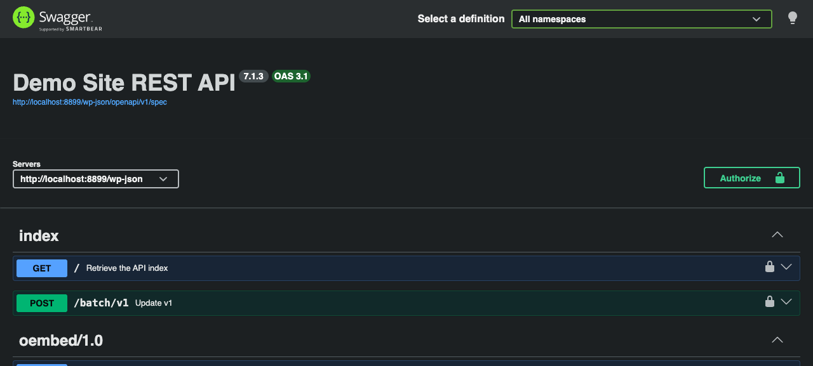

# OpenAPI Generator

Contributors: alleyinteractive

Tags: alleyinteractive, openapi, swagger, rest-api

Stable tag: 0.1.0

Requires at least: 6.5

Tested up to: 7.1

Requires PHP: 8.1

License: GPL v2 or later

[](https://github.com/alleyinteractive/wp-openapi-generator/actions/workflows/all-pr-tests.yml)

Generate an [OpenAPI 3.1](https://spec.openapis.org/oas/v3.1.0) document for the WordPress REST API, and browse and call it with [Swagger UI](https://swagger.io/tools/swagger-ui/).



The document is built from the routes registered with the REST server, so WordPress core, custom post types and taxonomies, other plugins, and your own `register_rest_route()` calls are all documented without extra work. Route arguments describe the request, and route schemas describe the response.

- [Installation](#installation)
- [Quick start](#quick-start)
- [How routes become OpenAPI](#how-routes-become-openapi)
- [Documenting your own routes](#documenting-your-own-routes)
- [Customizing the document](#customizing-the-document)
- [Settings and access](#settings-and-access)
- [Limitations](#limitations)
- [Development](#development)

## Installation

Install the plugin with Composer and activate it:

```bash
composer require alleyinteractive/wp-openapi-generator
wp plugin activate wp-openapi-generator
```

## Quick start

Once the plugin is active, there are three ways to get the document.

**Browse it.** Visit `/openapi/` on your site while logged in as an administrator. Pick a namespace from the "Select a definition" menu, narrow the list with the tag filter, and use "Try it out" to send real requests. Requests are sent with your login session and a REST nonce, so endpoints that need authentication work too.

**Fetch it.** The JSON document is served from the REST API:

```
GET /wp-json/openapi/v1/spec
GET /wp-json/openapi/v1/spec?namespace=wp/v2,my-plugin/v1
```

**Generate it.** Write it to a file with WP-CLI, for example to commit it alongside your code or feed a client generator:

```bash
wp openapi generate --output=openapi.json
wp openapi generate --namespace=my-plugin/v1 --compact

# Generate TypeScript types from it.
npx openapi-typescript openapi.json -o src/types/wordpress-api.ts
```

## How routes become OpenAPI

| WordPress | OpenAPI |
| --- | --- |
| Route regex `/wp/v2/posts/(?P<id>[\d]+)` | Path `/wp/v2/posts/{id}` with a required `id` path parameter |
| `args` on `GET` and `DELETE` endpoints | Query parameters. Arrays are sent comma-separated (`?include=1,2`), which WordPress accepts. |
| `args` on `POST`, `PUT`, and `PATCH` endpoints | A JSON request body |
| `type`, `enum`, `default`, `format`, `minimum`, `items`, `properties`, and other schema keywords | The same JSON Schema keywords |
| `required => true` on an argument or schema property | The parent's `required` list |
| `readonly => true` | `readOnly: true` |
| The route's `schema` callback | A shared schema under `components/schemas`, used as the response body |
| A `GET` endpoint with `page` or `per_page` arguments | A response that is an array of items, with `X-WP-Total` and `X-WP-TotalPages` headers |
| `POST` to that same route | A `201 Created` response |
| `DELETE` with a `force` argument | The trashed item, or `{ deleted, previous }` when permanently deleted |
| Creating media (`POST /wp/v2/media`) | A `multipart/form-data` file upload |
| Namespace and first path segment | A tag such as `wp/v2/posts` |
| `show_in_index => false` | Left out of the document |

WordPress-only keys such as `context`, `arg_options`, `sanitize_callback`, and `validate_callback` are dropped. Every operation gets a generated `operationId`, a summary such as "List posts" or "Update post", and a `default` error response that matches the shape of a `WP_Error`. Application passwords and cookie nonces are declared as security schemes.

## Documenting your own routes

The plugin documents what you already pass to `register_rest_route()`, so the best way to improve your documentation is to give every argument a `type` and `description`, and give every route a `schema`:

```php
register_rest_route(
	'my-plugin/v1',
	'/widgets/(?P<id>\d+)',
	[
		[
			'methods'             => WP_REST_Server::READABLE,
			'callback'            => 'my_plugin_get_widget',
			'permission_callback' => '__return_true',
			'args'                => [
				'id' => [
					'description' => 'Widget ID.',
					'type'        => 'integer',
				],
			],
		],
		[
			'methods'             => WP_REST_Server::EDITABLE,
			'callback'            => 'my_plugin_update_widget',
			'permission_callback' => 'my_plugin_can_edit_widgets',
			'args'                => [
				'name' => [
					'description' => 'Widget name.',
					'type'        => 'string',
					'required'    => true,
				],
			],
		],
		'schema' => fn () => [
			'$schema'    => 'http://json-schema.org/draft-04/schema#',
			'title'      => 'widget',
			'type'       => 'object',
			'properties' => [
				'id'   => [ 'type' => 'integer', 'readonly' => true ],
				'name' => [ 'type' => 'string' ],
			],
		],
	]
);
```

### The `openapi` endpoint option

Add an `openapi` array to an endpoint to set or replace any key of the generated [operation](https://spec.openapis.org/oas/v3.1.0#operation-object). Keys you set replace the generated ones entirely:

```php
[
	'methods'             => WP_REST_Server::CREATABLE,
	'callback'            => 'my_plugin_create_widget',
	'permission_callback' => 'my_plugin_can_edit_widgets',
	'openapi'             => [
		'summary'     => 'Create a widget',
		'description' => 'Creates a widget and returns it. Requires the `edit_widgets` capability.',
		'security'    => [ [ 'applicationPassword' => [] ] ],
	],
]
```

Set `'openapi' => false` to leave an endpoint out of the document.

## Customizing the document

Everything the plugin generates can be changed with filters. The narrower filters are applied first, and `wp_openapi_generator_spec` sees the finished document last.

| Filter | Use it to | Arguments |
| --- | --- | --- |
| `wp_openapi_generator_include_route` | Include or exclude whole routes | `bool $include`, `string $route`, `array $handlers`, `array $options` |
| `wp_openapi_generator_endpoint_args` | Change an endpoint's arguments, in WordPress format, before they become parameters or a request body | `array $args`, `string $method`, `string $route`, `array $handler` |
| `wp_openapi_generator_route_schema` | Change a route's response schema, in WordPress format, before it is converted | `?array $schema`, `string $route`, `array $options` |
| `wp_openapi_generator_responses` | Change an operation's responses | `array $responses`, `string $method`, `string $route`, `array $handler`, `?string $schema_ref` |
| `wp_openapi_generator_operation` | Change anything about one operation, or return `[]` to remove it | `array $operation`, `string $method`, `string $route`, `array $handler` |
| `wp_openapi_generator_info` | Change the title, version, description, contact, or license | `array $info` |
| `wp_openapi_generator_servers` | Change the server URLs | `array $servers` |
| `wp_openapi_generator_security_schemes` | Add, replace, or remove security schemes | `array $schemes` |
| `wp_openapi_generator_security` | Change the document-wide security requirements | `array $security` |
| `wp_openapi_generator_spec` | Change the finished document | `array $spec`, `string[] $namespaces` |
| `wp_openapi_generator_is_public` | Make the docs public or private, overriding the setting | `bool $is_public` |
| `wp_openapi_generator_capability` | Change who can view private docs | `string $capability` (default `manage_options`) |
| `wp_openapi_generator_swagger_ui_url` | Load Swagger UI from somewhere other than jsDelivr | `string $base_url` |

`$method` is always lowercase, and `$route` is the route regex exactly as registered, such as `/wp/v2/posts/(?P<id>[\d]+)`.

### Exclude routes

```php
add_filter(
	'wp_openapi_generator_include_route',
	function ( bool $include, string $route ): bool {
		return $include && ! str_starts_with( $route, '/my-plugin/v1/internal' );
	},
	10,
	2
);
```

To hide whole namespaces from the default document, remove them in the same filter, or link to a filtered document such as `/wp-json/openapi/v1/spec?namespace=my-plugin/v1`.

### Change request arguments

Arguments are filtered in the format `register_rest_route()` uses, so you can describe a request the way you would register it:

```php
add_filter(
	'wp_openapi_generator_endpoint_args',
	function ( array $args, string $method, string $route ): array {
		if ( 'post' === $method && '/my-plugin/v1/widgets' === $route ) {
			$args['color'] = [
				'description' => 'Widget color.',
				'type'        => 'string',
				'enum'        => [ 'red', 'green', 'blue' ],
			];
		}

		return $args;
	},
	10,
	3
);
```

### Change responses

Change the shared response schema for a route, in WordPress format:

```php
add_filter(
	'wp_openapi_generator_route_schema',
	function ( ?array $schema, string $route ): ?array {
		if ( '/my-plugin/v1/stats' === $route ) {
			return [
				'title'      => 'stats',
				'type'       => 'object',
				'properties' => [
					'views'    => [ 'type' => 'integer' ],
					'visitors' => [ 'type' => 'integer' ],
				],
			];
		}

		return $schema;
	},
	10,
	2
);
```

Or change individual responses, in OpenAPI format:

```php
add_filter(
	'wp_openapi_generator_responses',
	function ( array $responses, string $method, string $route, array $handler, ?string $schema_ref ): array {
		if ( 'get' === $method && $schema_ref && str_ends_with( $route, '(?P<id>[\d]+)' ) ) {
			$responses['404'] = [
				'description' => 'Not found.',
				'content'     => [
					'application/json' => [ 'schema' => [ '$ref' => '#/components/schemas/WP_Error' ] ],
				],
			];
		}

		return $responses;
	},
	10,
	5
);
```

### Override the servers

By default the document has one server, the site's REST URL. Point it somewhere else, or list several environments:

```php
add_filter(
	'wp_openapi_generator_servers',
	fn () => [
		[ 'url' => 'https://example.com/wp-json', 'description' => 'Production' ],
		[ 'url' => 'https://staging.example.com/wp-json', 'description' => 'Staging' ],
	]
);
```

### Override authentication

The document declares two security schemes, `applicationPassword` (HTTP Basic) and `cookieNonce` (the `X-WP-Nonce` header), and allows anonymous requests. The requirements are built from the schemes you declare, so replacing the schemes is usually enough:

```php
// Document a JWT plugin instead of the core methods.
add_filter(
	'wp_openapi_generator_security_schemes',
	fn () => [
		'jwt' => [
			'type'         => 'http',
			'scheme'       => 'bearer',
			'bearerFormat' => 'JWT',
		],
	]
);

// Require authentication on every operation, instead of allowing anonymous requests.
add_filter(
	'wp_openapi_generator_security',
	fn ( array $security ) => array_values( array_filter( $security, 'is_array' ) )
);
```

To change one operation's requirements, set `security` with the [`openapi` endpoint option](#the-openapi-endpoint-option) or the `wp_openapi_generator_operation` filter. Return an empty array from both security filters to remove authentication from the document.

### Change the info block

```php
add_filter(
	'wp_openapi_generator_info',
	fn ( array $info ) => [
		...$info,
		'title'   => 'Example API',
		'version' => '2.0.0',
		'contact' => [ 'email' => 'api@example.com' ],
	]
);
```

## Settings and access

Go to **Settings > OpenAPI** to:

- **Make the documentation public.** By default, only users with the `manage_options` capability can open the documentation page or fetch the JSON; everyone else gets a 404 page, and the JSON endpoint returns a 401 or 403. Turn on public access to let anyone view both. Endpoints still enforce their own permissions either way: public docs show what an endpoint accepts, not data the visitor can't otherwise reach.
- **Change the documentation path** from `openapi` to something like `api/docs`.

Without pretty permalinks, the documentation page is at `/?wp_openapi_generator_docs=1`.

Swagger UI is loaded from jsDelivr (`swagger-ui-dist`, pinned to a specific version). If your content security policy blocks the CDN, host the files yourself and point the `wp_openapi_generator_swagger_ui_url` filter at them.

## Limitations

WordPress doesn't record everything OpenAPI can describe, so some of the document is inferred:

- **Permissions.** A `permission_callback` can't be inspected, so the document doesn't say which operations need authentication. Set `security` per operation with the `openapi` option if you need it.
- **Responses.** The response body comes from the route's schema. Routes without one get an untyped response, and responses that differ from the schema, such as custom envelopes, need the `openapi` option or a filter.
- **Overlapping routes.** OpenAPI can't hold two paths that differ only by parameter name, such as `/icons/{collection}` and `/icons/{name}`. The route registered first is kept.
- **Optional path segments.** OpenAPI path parameters are always required, so a route with an optional segment, such as `/items(?:/(?P<id>\d+))?`, is documented with the segment present.
- **Arguments that accept an array or an object**, such as core's `categories` filter, are documented as arrays, because query strings send them comma-separated.
- **Media uploads** document only the `file` field. Set the title, alt text, and other fields with a follow-up update request.

## Development

```bash
composer install
composer test        # PHPCS, PHPStan, and PHPUnit
composer phpunit     # PHPUnit only
```

The tests use [Mantle's testing framework](https://mantle.alley.com/docs/testing) with SQLite, so they don't need a database. Run them from a checkout that isn't inside an existing WordPress install; otherwise Mantle uses that install and its database.

### Releasing

The [built release workflow](./.github/workflows/built-release.yml) tags a release whenever the version in `composer.json` or the plugin header changes on `develop`.

## Changelog

See [CHANGELOG](CHANGELOG.md).

## Credits

This project is actively maintained by [Alley Interactive](https://github.com/alleyinteractive). Like what you see? [Come work with us](https://alley.co/careers/).

- [Sean Fisher](https://github.com/srtfisher)
- [All Contributors](../../contributors)

## License

The GNU General Public License (GPL) license. Please see [License File](LICENSE) for more information.
